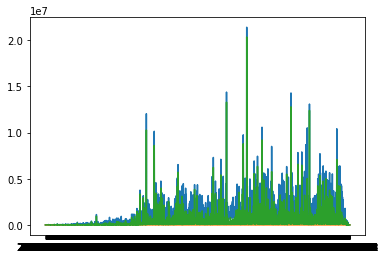
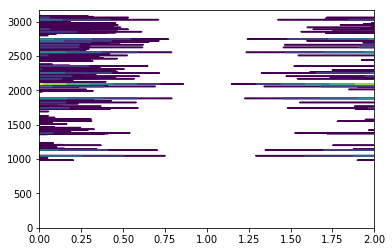

#### KS Sample data analysis project 
###### Data file from kaggle project.
###### Author: Avnit Bambah
###### Date : 04/04/2018 

### Learn how to plot in 2d and 3d. 
#### Group by the data set and create reports.


```python
%matplotlib inline 
# modules we'll use
import pandas as pd
import numpy as np

import matplotlib.pyplot as plt
```


```python
# read in all our data
ks_data = pd.read_csv("data/ks-data.csv")
ks_data.head(10)
```


```python
main_data = ks_data.groupby(['main_category','currency','pledged']).sum().fillna(0)
main_data.head(10)
```


<div>
<style>
    .dataframe thead tr:only-child th {
        text-align: right;
    }

    .dataframe thead th {
        text-align: left;
    }

    .dataframe tbody tr th {
        vertical-align: top;
    }
</style>
<table border="1" class="dataframe">
  <thead>
    <tr style="text-align: right;">
      <th></th>
      <th></th>
      <th></th>
      <th>ID</th>
      <th>goal</th>
      <th>backers</th>
      <th>usd pledged</th>
      <th>usd_pledged_real</th>
      <th>usd_goal_real</th>
    </tr>
    <tr>
      <th>main_category</th>
      <th>currency</th>
      <th>pledged</th>
      <th></th>
      <th></th>
      <th></th>
      <th></th>
      <th></th>
      <th></th>
    </tr>
  </thead>
  <tbody>
    <tr>
      <th rowspan="10" valign="top">Art</th>
      <th rowspan="10" valign="top">AUD</th>
      <th>0.0</th>
      <td>85309221240</td>
      <td>1951740.0</td>
      <td>0</td>
      <td>0.00</td>
      <td>0.00</td>
      <td>1674289.71</td>
    </tr>
    <tr>
      <th>1.0</th>
      <td>14270689056</td>
      <td>1290631.0</td>
      <td>13</td>
      <td>7.66</td>
      <td>10.55</td>
      <td>989246.84</td>
    </tr>
    <tr>
      <th>2.0</th>
      <td>5306746742</td>
      <td>25018100.0</td>
      <td>9</td>
      <td>8.07</td>
      <td>7.88</td>
      <td>19151082.36</td>
    </tr>
    <tr>
      <th>3.0</th>
      <td>808529669</td>
      <td>30.0</td>
      <td>1</td>
      <td>2.82</td>
      <td>2.80</td>
      <td>27.96</td>
    </tr>
    <tr>
      <th>5.0</th>
      <td>6512118491</td>
      <td>12700.0</td>
      <td>7</td>
      <td>18.39</td>
      <td>25.53</td>
      <td>10659.45</td>
    </tr>
    <tr>
      <th>6.0</th>
      <td>1683274517</td>
      <td>1000.0</td>
      <td>2</td>
      <td>5.64</td>
      <td>5.64</td>
      <td>940.56</td>
    </tr>
    <tr>
      <th>9.0</th>
      <td>1203811075</td>
      <td>500.0</td>
      <td>2</td>
      <td>8.38</td>
      <td>8.42</td>
      <td>467.60</td>
    </tr>
    <tr>
      <th>10.0</th>
      <td>9991481798</td>
      <td>23475.0</td>
      <td>9</td>
      <td>74.88</td>
      <td>74.72</td>
      <td>20348.56</td>
    </tr>
    <tr>
      <th>13.0</th>
      <td>542029527</td>
      <td>5000.0</td>
      <td>2</td>
      <td>12.16</td>
      <td>11.99</td>
      <td>4610.42</td>
    </tr>
    <tr>
      <th>16.0</th>
      <td>2812118558</td>
      <td>100015.0</td>
      <td>6</td>
      <td>27.98</td>
      <td>26.53</td>
      <td>79045.65</td>
    </tr>
  </tbody>
</table>
</div>


```python
grouped = ks_data.groupby('deadline').agg({"usd_pledged_real": [sum,min,max]})
grouped.head(10)
grouped.tail(10)
```


<div>
<style>
    .dataframe thead tr:only-child th {
        text-align: right;
    }

    .dataframe thead th {
        text-align: left;
    }

    .dataframe tbody tr th {
        vertical-align: top;
    }
</style>
<table border="1" class="dataframe">
  <thead>
    <tr>
      <th></th>
      <th colspan="3" halign="left">usd_pledged_real</th>
    </tr>
    <tr>
      <th></th>
      <th>sum</th>
      <th>min</th>
      <th>max</th>
    </tr>
    <tr>
      <th>deadline</th>
      <th></th>
      <th></th>
      <th></th>
    </tr>
  </thead>
  <tbody>
    <tr>
      <th>2017-11-24</th>
      <td>3555122.04</td>
      <td>0.00</td>
      <td>2209270.00</td>
    </tr>
    <tr>
      <th>2017-11-25</th>
      <td>1594187.93</td>
      <td>0.00</td>
      <td>424615.00</td>
    </tr>
    <tr>
      <th>2017-11-26</th>
      <td>630356.47</td>
      <td>0.00</td>
      <td>132795.34</td>
    </tr>
    <tr>
      <th>2017-11-27</th>
      <td>487843.91</td>
      <td>0.00</td>
      <td>84808.47</td>
    </tr>
    <tr>
      <th>2017-11-28</th>
      <td>955650.49</td>
      <td>0.00</td>
      <td>132246.00</td>
    </tr>
    <tr>
      <th>2017-11-29</th>
      <td>862662.23</td>
      <td>0.00</td>
      <td>147230.81</td>
    </tr>
    <tr>
      <th>2017-11-30</th>
      <td>2889150.20</td>
      <td>0.00</td>
      <td>552799.00</td>
    </tr>
    <tr>
      <th>2017-12-01</th>
      <td>4417653.57</td>
      <td>0.00</td>
      <td>901058.04</td>
    </tr>
    <tr>
      <th>2017-12-02</th>
      <td>1404655.77</td>
      <td>0.00</td>
      <td>308142.00</td>
    </tr>
    <tr>
      <th>2017-12-03</th>
      <td>1405305.66</td>
      <td>0.00</td>
      <td>525890.00</td>
    </tr>
    <tr>
      <th>2017-12-04</th>
      <td>1686918.43</td>
      <td>0.00</td>
      <td>319052.00</td>
    </tr>
    <tr>
      <th>2017-12-05</th>
      <td>1281472.11</td>
      <td>0.00</td>
      <td>333885.30</td>
    </tr>
    <tr>
      <th>2017-12-06</th>
      <td>1380214.37</td>
      <td>0.00</td>
      <td>193463.91</td>
    </tr>
    <tr>
      <th>2017-12-07</th>
      <td>4239030.75</td>
      <td>0.00</td>
      <td>1374021.00</td>
    </tr>
    <tr>
      <th>2017-12-08</th>
      <td>1569119.93</td>
      <td>0.00</td>
      <td>392050.00</td>
    </tr>
    <tr>
      <th>2017-12-09</th>
      <td>3614540.76</td>
      <td>0.00</td>
      <td>1059078.19</td>
    </tr>
    <tr>
      <th>2017-12-10</th>
      <td>1169818.59</td>
      <td>0.00</td>
      <td>336976.00</td>
    </tr>
    <tr>
      <th>2017-12-11</th>
      <td>776343.46</td>
      <td>0.00</td>
      <td>108671.00</td>
    </tr>
    <tr>
      <th>2017-12-12</th>
      <td>994899.16</td>
      <td>0.00</td>
      <td>169854.00</td>
    </tr>
    <tr>
      <th>2017-12-13</th>
      <td>1491456.65</td>
      <td>0.00</td>
      <td>490319.00</td>
    </tr>
    <tr>
      <th>2017-12-14</th>
      <td>3459127.75</td>
      <td>0.00</td>
      <td>905442.20</td>
    </tr>
    <tr>
      <th>2017-12-15</th>
      <td>2840262.83</td>
      <td>0.00</td>
      <td>299078.55</td>
    </tr>
    <tr>
      <th>2017-12-16</th>
      <td>1535061.83</td>
      <td>0.00</td>
      <td>200493.60</td>
    </tr>
    <tr>
      <th>2017-12-17</th>
      <td>3024527.28</td>
      <td>0.00</td>
      <td>959437.00</td>
    </tr>
    <tr>
      <th>2017-12-18</th>
      <td>930112.96</td>
      <td>0.00</td>
      <td>183672.00</td>
    </tr>
    <tr>
      <th>2017-12-19</th>
      <td>818062.72</td>
      <td>0.00</td>
      <td>290429.00</td>
    </tr>
    <tr>
      <th>2017-12-20</th>
      <td>1589046.53</td>
      <td>0.00</td>
      <td>215487.75</td>
    </tr>
    <tr>
      <th>2017-12-21</th>
      <td>2740310.61</td>
      <td>0.00</td>
      <td>300401.50</td>
    </tr>
    <tr>
      <th>2017-12-22</th>
      <td>1545897.78</td>
      <td>0.00</td>
      <td>264616.52</td>
    </tr>
    <tr>
      <th>2017-12-23</th>
      <td>1482775.77</td>
      <td>0.00</td>
      <td>312061.00</td>
    </tr>
    <tr>
      <th>...</th>
      <td>...</td>
      <td>...</td>
      <td>...</td>
    </tr>
    <tr>
      <th>2018-02-02</th>
      <td>56446.25</td>
      <td>0.00</td>
      <td>24849.00</td>
    </tr>
    <tr>
      <th>2018-02-03</th>
      <td>283099.38</td>
      <td>0.00</td>
      <td>270290.50</td>
    </tr>
    <tr>
      <th>2018-02-04</th>
      <td>24453.00</td>
      <td>0.00</td>
      <td>15166.00</td>
    </tr>
    <tr>
      <th>2018-02-05</th>
      <td>408851.98</td>
      <td>0.00</td>
      <td>336966.21</td>
    </tr>
    <tr>
      <th>2018-02-06</th>
      <td>154314.81</td>
      <td>0.00</td>
      <td>136755.34</td>
    </tr>
    <tr>
      <th>2018-02-07</th>
      <td>58141.35</td>
      <td>0.00</td>
      <td>42799.00</td>
    </tr>
    <tr>
      <th>2018-02-08</th>
      <td>10716.49</td>
      <td>0.00</td>
      <td>4086.48</td>
    </tr>
    <tr>
      <th>2018-02-09</th>
      <td>6759.43</td>
      <td>0.00</td>
      <td>2350.00</td>
    </tr>
    <tr>
      <th>2018-02-10</th>
      <td>50459.76</td>
      <td>0.00</td>
      <td>37697.00</td>
    </tr>
    <tr>
      <th>2018-02-11</th>
      <td>7667.67</td>
      <td>0.00</td>
      <td>2527.95</td>
    </tr>
    <tr>
      <th>2018-02-12</th>
      <td>273298.29</td>
      <td>0.00</td>
      <td>158883.48</td>
    </tr>
    <tr>
      <th>2018-02-13</th>
      <td>21042.33</td>
      <td>0.00</td>
      <td>19766.00</td>
    </tr>
    <tr>
      <th>2018-02-14</th>
      <td>7911.84</td>
      <td>0.00</td>
      <td>3127.00</td>
    </tr>
    <tr>
      <th>2018-02-15</th>
      <td>19487.17</td>
      <td>3.99</td>
      <td>13978.13</td>
    </tr>
    <tr>
      <th>2018-02-16</th>
      <td>64513.19</td>
      <td>0.00</td>
      <td>63444.59</td>
    </tr>
    <tr>
      <th>2018-02-17</th>
      <td>29025.43</td>
      <td>0.00</td>
      <td>12343.00</td>
    </tr>
    <tr>
      <th>2018-02-18</th>
      <td>2843.00</td>
      <td>0.00</td>
      <td>515.00</td>
    </tr>
    <tr>
      <th>2018-02-19</th>
      <td>4005.46</td>
      <td>0.00</td>
      <td>1608.15</td>
    </tr>
    <tr>
      <th>2018-02-20</th>
      <td>4720.61</td>
      <td>0.00</td>
      <td>2493.01</td>
    </tr>
    <tr>
      <th>2018-02-21</th>
      <td>10857.27</td>
      <td>0.00</td>
      <td>4886.00</td>
    </tr>
    <tr>
      <th>2018-02-22</th>
      <td>355.97</td>
      <td>0.00</td>
      <td>191.71</td>
    </tr>
    <tr>
      <th>2018-02-23</th>
      <td>11129.63</td>
      <td>11.98</td>
      <td>6894.99</td>
    </tr>
    <tr>
      <th>2018-02-24</th>
      <td>17328.00</td>
      <td>0.00</td>
      <td>15179.00</td>
    </tr>
    <tr>
      <th>2018-02-25</th>
      <td>1243.14</td>
      <td>0.00</td>
      <td>767.92</td>
    </tr>
    <tr>
      <th>2018-02-26</th>
      <td>1765.38</td>
      <td>0.00</td>
      <td>487.00</td>
    </tr>
    <tr>
      <th>2018-02-27</th>
      <td>436.73</td>
      <td>0.00</td>
      <td>430.00</td>
    </tr>
    <tr>
      <th>2018-02-28</th>
      <td>1323.80</td>
      <td>0.00</td>
      <td>1225.00</td>
    </tr>
    <tr>
      <th>2018-03-01</th>
      <td>57.36</td>
      <td>1.00</td>
      <td>50.00</td>
    </tr>
    <tr>
      <th>2018-03-02</th>
      <td>1518.19</td>
      <td>0.00</td>
      <td>557.80</td>
    </tr>
    <tr>
      <th>2018-03-03</th>
      <td>174.00</td>
      <td>0.00</td>
      <td>174.00</td>
    </tr>
  </tbody>
</table>
<p>100 rows × 3 columns</p>
</div>


```python
plt.plot(grouped)
```


    [<matplotlib.lines.Line2D at 0x151102828>,
     <matplotlib.lines.Line2D at 0x150e655c0>,
     <matplotlib.lines.Line2D at 0x150e6c668>]





```python
plt.contour(grouped)
```


    <matplotlib.contour.QuadContourSet at 0x15075c400>




# 3d ploting 
from mpl_toolkits.mplot3d import axes3d
from matplotlib import cm 

fig = plt.figure()
ax = fig.gca(projection='3d')
cset = ax.contour(grouped,grouped,grouped)
plt.show()